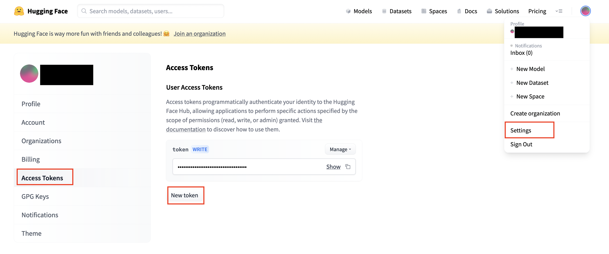
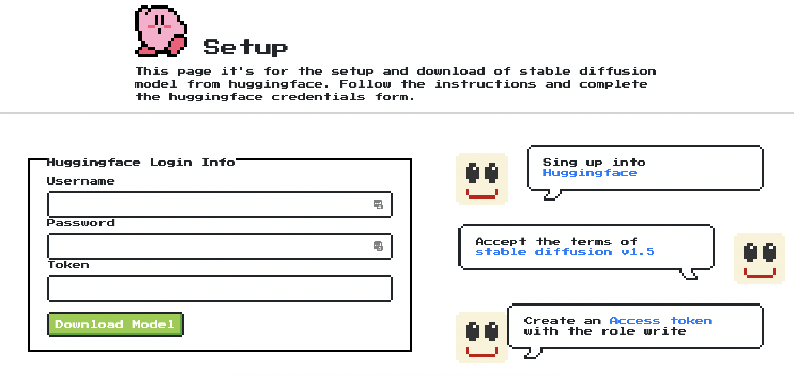
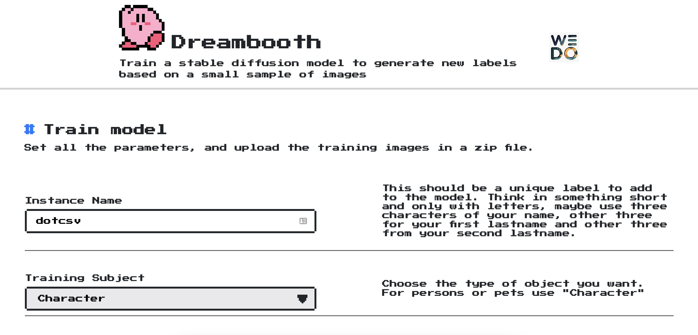

# dreambooth-webui
Simple webui to setup and train dreambooth for stable diffusion.

Tested on a ubuntu 22.04 where the https://github.com/AUTOMATIC1111/stable-diffusion-webui its also installed.

## Requirements
- You need to have installed some dependencies

```
apt install wget git git-lfs python3 python3-pip python3-venv unzip -y
```

- Clone this repository.
```
git clone https://github.com/carlgira/dreambooth-webui
```

## Install & Run
To install and run dreambooth you need to execute the start script. It will check for the requirements, create a python env, install the dependencies and run the flask server.
```
sh start.sh
```

You can start the script as a service in your machine by executing the next as root.
```
cat <<EOT >> /etc/systemd/system/dreambooth.service
[Unit]
Description=systemd service start dreambooth

[Service]
ExecStart=/bin/bash /home/ubuntu/dreambooth-webui/start.sh
User=ubuntu

[Install]
WantedBy=multi-user.target
EOT

systemctl daemon-reload
systemctl enable dreambooth.service
systemctl start dreambooth
```

## Test

### Setup
The first step is to download the stable-diffusion model, for that, is necessary to have a huggingface account, create a token and accept to the conditions to use stable-diffusion.

1. Go to https://huggingface.co and create an account.
2. Go to https://huggingface.co/runwayml/stable-diffusion-v1-5 and accept the terms and conditions.
3. Create an "Access token".
    - Open your **Profile**
    - Go to **Settings**
    - Open **Access Token** and create a token with the role **"write"**



Once the account is created, go to http://localhost:3000 and put the credentials to download the stable diffusion model.



This is going to take 5 minutes, after that time, you are ready to go to test everything. (the configuration screen wont appear again)


### Dreambooth - Fine tunning process
Go to http://localhost:3000, it has several inputs, but most of them you can leave the default value and the page helps you on how to fill everything. 

Most of the time you only need two inputs: the **instance name** as a unique label to identify the thing or person you want to to train the model, and a **zip file** with the set of images you are going to use. (copy that label somewhere because you are going to needed for later)

In case you want to use it on yourself, make sure that your images comply with the next conditions:
- All images must be 512 x 512
- Make sure you are alone in the pictures
- Have different clothing
- Different facial expressions
- Different backgrounds
- Different angles
- Only zip the images, *do not use folders*.
- 3–5 images of full body
- 5–7 images of half body
- 10–15 close images of your face



Press on "Generate", if everything is ok, you will see a countdown of the time it will take the training. That page will redirect you directly to the stable-diffusion-webui and you can start testing.

Some prompts that you can use using the unique label you pass during training could be:

> photo of &lt;your-label&gt; as a funko

> photo of &lt;your-label&gt; as a character of game of thrones

> portrait of &lt;your-label&gt; with fully armored norse valkyrie, brass plated, symmetric golden wings, divine vibes,  sky background, sharp focus, highly detailed, cinematic lighting, studio quality, smooth render, unreal engine 5 rendered, octane, rendered, by artgerm, greg rutkowski, alphonse mucha

## References
Using the dreambooth-webui in Oracle Cloud https://github.com/carlgira/oci-generative-ai
